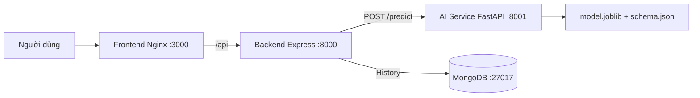

# Chẩn đoán ung thư vú

Bài tập lớn Học máy cơ bản (221180) - lớp 12523W.2.

## 1. Thành viên và phân công

| Thành viên       | MSSV     | Phần việc                                 |
| ---------------- | -------- | ----------------------------------------- |
| Bùi Đăng Huy     | 10123154 | ML pipeline, AI Service, Backend, Docker  |
| Nguyễn Vĩnh Phúc | 12523066 | EDA, đánh giá model, tài liệu và Frontend |

## 2. Bài toán

Project giải bài toán phân loại nhị phân trên **Breast Cancer Wisconsin (Diagnostic) Data Set**.

- Target: `diagnosis`.
- `B`: benign/lành tính.
- `M`: malignant/ác tính.
- Lớp dương trong model: `malignant`.
- Mục tiêu ứng dụng: nhận các phép đo nhân tế bào và trả về nhãn dự đoán cùng xác suất của lớp ác tính.

Đây là sản phẩm phục vụ học tập, không thay thế chẩn đoán hoặc quyết định điều trị y khoa.

## 3. Dữ liệu

Dataset được lưu trong [ai-models/data/dataset.zip](ai-models/data/dataset.zip). Chi tiết nguồn, license, schema, chất lượng dữ liệu và tiền xử lý nằm tại [ai-models/data/data.md](ai-models/data/data.md).

- Nguồn tải: [Kaggle - Breast Cancer Wisconsin (Diagnostic) Data Set](https://www.kaggle.com/datasets/uciml/breast-cancer-wisconsin-data).
- Nguồn gốc: [UCI Machine Learning Repository](https://archive.ics.uci.edu/dataset/17/breast+cancer+wisconsin+diagnostic).
- License: CC BY-NC-SA 4.0.
- Quy mô: 569 mẫu, 33 cột gốc, 30 feature dùng cho model.
- Phân bố nhãn: 357 benign và 212 malignant.

## 4. EDA và tiền xử lý

EDA có 6 hình được lưu trong [docs/figures](docs/figures): phân bố nhãn, histogram, missing values, correlation, boxplot và pairplot. Mỗi nhóm hình có quan sát và quyết định xử lý tương ứng.

Quy trình xử lý:

1. Đọc `data.csv` từ `dataset.zip`.
2. Loại `id` vì chỉ là định danh.
3. Loại `Unnamed: 32` vì là cột rỗng.
4. Loại dòng trùng lặp.
5. Ánh xạ `B -> 0`, `M -> 1`.
6. Chia train/test theo tỷ lệ 80/20 với `stratify=y` và `random_state=42`.
7. Đóng gói `SimpleImputer(median)` và `StandardScaler` trong pipeline để tránh data leakage.

## 5. Huấn luyện và kết quả model

Project thử nghiệm 5 model với cùng cách chia dữ liệu và GridSearchCV trên tập train:

| Model               | Test Recall | Test Precision | Test F1 | Test ROC-AUC |
| ------------------- | ----------: | -------------: | ------: | -----------: |
| Logistic Regression |      0.9762 |         1.0000 |  0.9880 |       0.9977 |
| KNN                 |      0.8571 |         0.9730 |  0.9114 |       0.9825 |
| SVM (RBF)           |      0.9762 |         1.0000 |  0.9880 |       0.9970 |
| Decision Tree       |      0.8333 |         0.8974 |  0.8642 |       0.9076 |
| Random Forest       |      0.9286 |         1.0000 |  0.9630 |       0.9965 |

Chi tiết tham số, thời gian, kích thước model và PR-AUC nằm trong [docs/model_comparison.csv](docs/model_comparison.csv).

### Model được chọn

Chọn **Logistic Regression (baseline), C=0.1** vì có Recall/F1/ROC-AUC rất cao, kích thước file nhỏ và thời gian dự đoán thấp hơn các model ensemble. SVM có F1 tương đương nhưng model Logistic Regression nhẹ hơn và dễ giải thích hơn.

## 6. Đóng gói model

- Pipeline + model: [ai-models/models/model.joblib](ai-models/models/model.joblib).
- Schema cho FE/BE/AI: [ai-models/models/schema.json](ai-models/models/schema.json).
- Tên model, metric, ngày huấn luyện và phiên bản thư viện: [ai-models/models/metadata.json](ai-models/models/metadata.json).

`model.joblib` được fit lại trên toàn bộ 569 mẫu sau khi chọn model. AI Service nạp file này ngay lúc container khởi động, không nạp lại ở mỗi request.

## 7. Kiến trúc hệ thống



Request được gắn `request_id` và log xuyên suốt Backend -> AI Service. Frontend dùng Nginx reverse proxy nên trình duyệt chỉ cần gọi cùng origin `/api`.

## 8. Chạy local bằng Docker

Yêu cầu: Docker Desktop có Docker Compose.

```powershell
Copy-Item .env.example .env
docker compose up --build
```

Các địa chỉ local:

| Thành phần          | URL                          |
| ------------------- | ---------------------------- |
| Frontend            | http://localhost:3000        |
| Backend health      | http://localhost:8000/health |
| AI Service health   | http://localhost:8001/health |
| AI Service API docs | http://localhost:8001/docs   |
| MongoDB             | `localhost:27017`            |

Xem trạng thái và log:

```powershell
docker compose ps
docker compose logs -f backend ai-service mongodb
```

## 9. Biến môi trường

| Biến                    | Ý nghĩa                                     | Giá trị local/Docker                      |
| ----------------------- | ------------------------------------------- | ----------------------------------------- |
| `MONGODB_URI`           | MongoDB khi Backend chạy trực tiếp trên máy | `mongodb://localhost:27017/breast_cancer` |
| `MONGODB_URI_DOCKER`    | MongoDB trong Docker network                | `mongodb://mongodb:27017/breast_cancer`   |
| `AI_SERVICE_URL`        | AI Service khi Backend chạy trên máy        | `http://localhost:8001`                   |
| `AI_SERVICE_URL_DOCKER` | AI Service trong Docker network             | `http://ai-service:8001`                  |
| `PORT`                  | Port Backend                                | `8000`                                    |
| `CORS_ORIGIN`           | Origin được phép gọi Backend                | `http://localhost:3000`                   |

`.env` không được commit. Chỉ commit [.env.example](.env.example), không chứa credential thật.

## 10. API contract

### Backend

```text
GET  /health
GET  /api/schema
GET  /api/model-info
POST /api/predict
GET  /api/history
```

Request tối giản:

```json
{
  "features": {
    "radius_mean": 14.0,
    "texture_mean": 20.0
  }
}
```

Request thực tế phải có đủ 30 feature theo `schema.json`. Response thành công gồm `prediction`, `probability`, `model_version` và `request_id`.

## 11. Notebook và huấn luyện lại

Chạy theo thứ tự:

1. [01_eda.ipynb](ai-models/colab/01_eda.ipynb)
2. [02_preprocess.ipynb](ai-models/colab/02_preprocess.ipynb)
3. [03_train.ipynb](ai-models/colab/03_train.ipynb)
4. [04_evaluate.ipynb](ai-models/colab/04_evaluate.ipynb)
5. [05_package.ipynb](ai-models/colab/05_package.ipynb)

Notebook tìm `ai-models/data/dataset.zip` từ repository hiện tại, không clone repository khác và ghi artifact về đúng thư mục của project.

## 12. Kiểm thử và hiệu năng

Các kiểm tra đã thực hiện:

- AI Service: 7 test pass.
- Backend: 8 test pass.
- Frontend JavaScript: `node --check` pass.
- Docker Compose: 4 service healthy/running.
- Smoke test qua Frontend: HTTP 200, schema 30 feature, prediction thành công và history lưu được vào MongoDB.

Đo tải đồng thời/p50/p95 chưa được thực hiện; đây là phần cần bổ sung trước khi công bố số liệu hiệu năng chính thức.

## 13. Triển khai và demo online

Hiện project đã xác minh trên local Docker. Chưa cấu hình địa chỉ public cố định hoặc tunnel.

Khi deploy:

1. Cập nhật `AI_SERVICE_URL_DOCKER` hoặc biến tương ứng theo nền tảng deploy.
2. Cập nhật `CORS_ORIGIN` theo domain Frontend.
3. Kiểm tra lại luồng Frontend -> Backend -> AI Service -> MongoDB.
4. Cập nhật URL public vào README.
5. Nếu dùng ngrok/tunnel, ghi thời điểm và URL mới trong nhật ký bên dưới mỗi lần đổi.

### Demo online

Chưa triển khai. Sẽ cập nhật sau khi có URL public.

### Nhật ký đổi cổng/tunnel

| Thời điểm | Địa chỉ cũ | Địa chỉ mới | Ghi chú             |
| --------- | ---------- | ----------- | ------------------- |
| Chưa có   | -          | -           | Chưa sử dụng tunnel |

## 14. Hạn chế và hướng phát triển

- Dataset nhỏ và chỉ mô tả một nhóm dữ liệu FNA, nên không đại diện cho mọi quần thể bệnh nhân.
- Model chưa được kiểm định lâm sàng.
- Chưa có load test đồng thời và chưa triển khai public.
- MongoDB local hiện dùng cấu hình không mật khẩu cho môi trường học tập; production cần dùng secret/credential an toàn.
- Hướng phát triển: thêm xác thực người dùng, giám sát model drift, load test, CI/CD, deploy public và bổ sung kiểm định trên dữ liệu ngoài tập huấn luyện.
