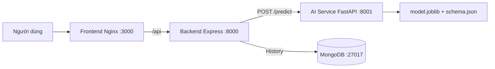

# Chẩn đoán ung thư vú

Bài tập lớn Học máy cơ bản (221180) - lớp 12523W.2.

## 1. Thành viên và phân công

| Thành viên       | MSSV     | Phần việc                                 |
| ---------------- | -------- | ----------------------------------------- |
| Bùi Đăng Huy     | 10123154 | ML pipeline, AI Service, Backend, Docker  |
| Nguyễn Vĩnh Phúc | 12523066 | EDA, đánh giá model, tài liệu và Frontend |

## 2. Bài toán

Project giải bài toán phân loại nhị phân trên **Breast Cancer Wisconsin (Diagnostic) Data Set**.

- Target: `diagnosis`.
- `B`: benign/lành tính.
- `M`: malignant/ác tính.
- Lớp dương trong model: `malignant`.
- Mục tiêu ứng dụng: nhận các phép đo nhân tế bào và trả về nhãn dự đoán cùng xác suất của lớp ác tính.

Đây là sản phẩm phục vụ học tập, không thay thế chẩn đoán hoặc quyết định điều trị y khoa.

## 3. Dữ liệu

Dataset được lưu trong [ai-models/data/dataset.zip](ai-models/data/dataset.zip). Chi tiết nguồn, license, schema, chất lượng dữ liệu và tiền xử lý nằm tại [ai-models/data/data.md](ai-models/data/data.md).

- Nguồn tải: [Kaggle - Breast Cancer Wisconsin (Diagnostic) Data Set](https://www.kaggle.com/datasets/uciml/breast-cancer-wisconsin-data).
- Nguồn gốc: [UCI Machine Learning Repository](https://archive.ics.uci.edu/dataset/17/breast+cancer+wisconsin+diagnostic).
- License: CC BY-NC-SA 4.0.
- Quy mô: 569 mẫu, 33 cột gốc, 30 feature dùng cho model.
- Phân bố nhãn: 357 benign và 212 malignant.

## 4. EDA và tiền xử lý

EDA có 6 hình được lưu trong [docs/figures](docs/figures): phân bố nhãn, histogram, missing values, correlation, boxplot và pairplot. Mỗi nhóm hình có quan sát và quyết định xử lý tương ứng.

Quy trình xử lý:

1. Đọc `data.csv` từ `dataset.zip`.
2. Loại `id` vì chỉ là định danh.
3. Loại `Unnamed: 32` vì là cột rỗng.
4. Loại dòng trùng lặp.
5. Ánh xạ `B -> 0`, `M -> 1`.
6. Chia train/test theo tỷ lệ 80/20 với `stratify=y` và `random_state=42`.
7. Đóng gói `SimpleImputer(median)` và `StandardScaler` trong pipeline để tránh data leakage.

## 5. Huấn luyện và kết quả model

Project thử nghiệm 5 model với cùng cách chia dữ liệu và GridSearchCV trên tập train:

| Model               | Test Recall | Test Precision | Test F1 | Test ROC-AUC |
| ------------------- | ----------: | -------------: | ------: | -----------: |
| Logistic Regression |      0.9762 |         1.0000 |  0.9880 |       0.9977 |
| KNN                 |      0.8571 |         0.9730 |  0.9114 |       0.9825 |
| SVM (RBF)           |      0.9762 |         1.0000 |  0.9880 |       0.9970 |
| Decision Tree       |      0.8333 |         0.8974 |  0.8642 |       0.9076 |
| Random Forest       |      0.9286 |         1.0000 |  0.9630 |       0.9965 |

Chi tiết tham số, thời gian, kích thước model và PR-AUC nằm trong [docs/model_comparison.csv](docs/model_comparison.csv).

### Model được chọn

Chọn **Logistic Regression (baseline), C=0.1** vì có Recall/F1/ROC-AUC rất cao, kích thước file nhỏ và thời gian dự đoán thấp hơn các model ensemble. SVM có F1 tương đương nhưng model Logistic Regression nhẹ hơn và dễ giải thích hơn.

## 6. Đóng gói model

- Pipeline + model: [ai-models/models/model.joblib](ai-models/models/model.joblib).
- Schema cho FE/BE/AI: [ai-models/models/schema.json](ai-models/models/schema.json).
- Tên model, metric, ngày huấn luyện và phiên bản thư viện: [ai-models/models/metadata.json](ai-models/models/metadata.json).

`model.joblib` được fit lại trên toàn bộ 569 mẫu sau khi chọn model. AI Service nạp file này ngay lúc container khởi động, không nạp lại ở mỗi request.

## 7. Kiến trúc hệ thống


```mermaid
flowchart LR
		U[Người dùng] --> FE[Frontend Nginx :3000]
		FE -->|/api| BE[Backend Express :8000]
		BE -->|POST /predict| AI[AI Service FastAPI :8001]
		BE -->|History| DB[(MongoDB :27017)]
		AI --> M[model.joblib + schema.json]
```

Nginx tạo `request_id` nếu request chưa có, ghi access log có cấu trúc và chuyển tiếp cùng ID qua Backend tới AI Service. Dùng ID này để lần theo một request dự đoán trong log cả ba service.

## 8. Chạy local bằng Docker

Yêu cầu: Docker Desktop có Docker Compose.

```powershell
Copy-Item .env.example .env
docker compose up --build
```

Các địa chỉ local:

| Thành phần          | URL                          |
| ------------------- | ---------------------------- |
| Frontend            | http://localhost:3000        |
| Frontend health     | http://localhost:3000/health |
| Backend health      | http://localhost:8000/health |
| AI Service health   | http://localhost:8001/health |
| AI Service API docs | http://localhost:8001/docs   |
| MongoDB             | `localhost:27017`            |

Các port publish ra máy host có thể đổi bằng `FRONTEND_HOST_PORT`, `BACKEND_HOST_PORT`, `AI_SERVICE_HOST_PORT` và `MONGODB_HOST_PORT` trong `.env`. Port bên trong Docker giữ nguyên để các service tiếp tục gọi nhau qua Docker network; nếu đổi host port, cập nhật URL local tương ứng. Khi truy cập Backend trực tiếp từ một origin khác, cập nhật thêm `CORS_ORIGIN` trong `.env`.

Xem trạng thái và log:

```powershell
docker compose ps
docker compose logs -f frontend backend ai-service mongodb
```

`GET /health` của Frontend trả JSON gồm `status`, `service`, `port` và `uptime_seconds`; trạng thái container cũng được Docker Compose kiểm tra qua healthcheck.

## 9. Biến môi trường

| Biến                    | Ý nghĩa                                     | Giá trị local/Docker                      |
| ----------------------- | ------------------------------------------- | ----------------------------------------- |
| `MONGODB_URI`           | MongoDB khi Backend chạy trực tiếp trên máy | `mongodb://localhost:27017/breast_cancer` |
| `MONGODB_URI_DOCKER`    | MongoDB trong Docker network                | `mongodb://mongodb:27017/breast_cancer`   |
| `AI_SERVICE_URL`        | AI Service khi Backend chạy trên máy        | `http://localhost:8001`                   |
| `AI_SERVICE_URL_DOCKER` | AI Service trong Docker network             | `http://ai-service:8001`                  |
| `PORT`                  | Port Backend                                | `8000`                                    |
| `CORS_ORIGIN`           | Origin được phép gọi Backend                | `http://localhost:3000`                   |
| `FRONTEND_HOST_PORT`    | Port Frontend publish trên máy host         | `3000`                                    |
| `BACKEND_HOST_PORT`     | Port Backend publish trên máy host          | `8000`                                    |
| `AI_SERVICE_HOST_PORT`  | Port AI Service publish trên máy host       | `8001`                                    |
| `MONGODB_HOST_PORT`     | Port MongoDB publish trên máy host          | `27017`                                   |

`.env` không được commit. Chỉ commit [.env.example](.env.example), không chứa credential thật.

## 10. API contract

### Backend

```text
GET  /health
GET  /api/schema
GET  /api/model-info
POST /api/predict
GET  /api/history
```

Request tối giản:

```json
{
  "features": {
    "radius_mean": 14.0,
    "texture_mean": 20.0
  }
}
```

Request thực tế phải có đủ 30 feature theo `schema.json`. Response thành công gồm `prediction`, `probability`, `model_version` và `request_id`.

## 11. Notebook và huấn luyện lại

Chạy theo thứ tự:

1. [01_eda.ipynb](ai-models/colab/01_eda.ipynb)
2. [02_preprocess.ipynb](ai-models/colab/02_preprocess.ipynb)
3. [03_train.ipynb](ai-models/colab/03_train.ipynb)
4. [04_evaluate.ipynb](ai-models/colab/04_evaluate.ipynb)
5. [05_package.ipynb](ai-models/colab/05_package.ipynb)

Notebook ưu tiên nhận diện repository hiện tại và dùng `ai-models/data/dataset.zip`; nếu chạy trên Colab chưa có repository, các notebook preprocessing/training/evaluation/package tự clone repository vào `/content`. Artifact được ghi về đúng thư mục của project.

## 12. Kiểm thử và hiệu năng

Các kiểm tra đã thực hiện:

- AI Service: 7 test pass.
- Backend: 8 test pass.
- Frontend JavaScript: `node --check` pass.
- Docker Compose: 4 service healthy/running.
- Smoke test qua Frontend: HTTP 200, schema 30 feature, prediction thành công và history lưu được vào MongoDB.
- Restart & Run All đã hoàn tất cho cả 5 notebook bằng kernel sạch: 36/36 code cell chạy, không có cell lỗi.
- Artifact được tạo/xác nhận: 6 hình EDA, 4 hình đánh giá, hai file ZIP hình, bảng 5 model, `model.joblib`, `schema.json` và `metadata.json`; model nạp lại và predict được với 30 feature.

### Load test API

Script benchmark: [tools/load_test.js](tools/load_test.js). Script lấy schema từ Backend để tạo 30 giá trị tổng hợp nằm trong khoảng hợp lệ, sau đó gửi `POST /api/predict` qua Frontend; mỗi request kiểm tra HTTP 200 và response có prediction/request ID.

Chạy trên PowerShell khi Docker Compose đang hoạt động:

```powershell
Get-Content .\tools\load_test.js -Raw | docker run --rm -i `
	-e VUS=10 -e DURATION=1m grafana/k6:2.3.0 run -
```

Kết quả ngày 27/09/2026 trên Docker Compose local đã warm-up:

| Virtual users | Thời lượng | Predict thành công | Throughput predict |      p50 |      p95 |       Max | Lỗi predict |
| ------------: | ---------: | -----------------: | -----------------: | -------: | -------: | --------: | ----------: |
|            10 |     1 phút |            594/594 |  9.74 request/giây | 13.69 ms | 27.88 ms | 120.92 ms |          0% |

K6 báo 0% HTTP request lỗi trên tổng 595 request (gồm 1 lần tải schema); 1,188/1,188 checks đạt. Ngưỡng đặt cho lần đo là error rate dưới 1% và p95 dưới 2 giây, cả hai đều đạt. Tải dùng giá trị midpoint tổng hợp từ schema, không phải dữ liệu bệnh nhân. Kết quả này đo trên máy local với một lượt chạy, không phải giới hạn tải tối đa hay cam kết hiệu năng khi deploy/tunnel.

## 13. Triển khai và demo online

### Trạng thái hiện tại

Frontend của ứng dụng đang được public qua ngrok; tunnel hiện trỏ tới `http://localhost:3000`. Luồng người dùng đi qua Frontend -> Backend -> AI Service -> MongoDB trong Docker Compose. URL và health endpoint đã được kiểm tra hoạt động ngày 29/09/2026. Với ngrok miễn phí, trình duyệt có thể hiện trang cảnh báo trước khi vào ứng dụng.

Tunnel hiện chỉ public ứng dụng Frontend. Backend hiện gọi AI Service qua Docker network (`http://ai-service:8001`). Vì yêu cầu đề tài cần cả App và AI Service public được, phần public trực tiếp AI Service vẫn cần hoàn thiện hoặc xác nhận cách triển khai với giảng viên.

Nếu tunnel đổi URL, cập nhật địa chỉ mới trong README và `.env` theo cấu hình triển khai, kiểm tra lại luồng dự đoán và ghi thêm một dòng vào nhật ký bên dưới. Nếu dùng tunnel không có địa chỉ ổn định, kiểm tra và cập nhật link vào sáng thứ Hai hàng tuần.

### Demo online

[https://resonant-askew-fiftieth.ngrok-free.dev/](https://resonant-askew-fiftieth.ngrok-free.dev/)

### Nhật ký đổi cổng/tunnel

| Thời điểm ghi nhận | Địa chỉ cũ    | Địa chỉ mới                                     | Ghi chú                                     |
| ------------------ | ------------- | ----------------------------------------------- | ------------------------------------------- |
| 2026-09-29         | Chưa ghi nhận | https://resonant-askew-fiftieth.ngrok-free.dev/ | Xác nhận frontend và `/health` trả HTTP 200 |

## 14. Hạn chế và hướng phát triển

- Dataset nhỏ và chỉ mô tả một nhóm dữ liệu FNA, nên không đại diện cho mọi quần thể bệnh nhân.
- Model chưa được kiểm định lâm sàng.
- Đã load test local 10 VU trong 1 phút; chưa xác định ngưỡng chịu tải tối đa hoặc benchmark trên môi trường public.
- MongoDB local hiện dùng cấu hình không mật khẩu cho môi trường học tập; production cần dùng secret/credential an toàn.
- Hướng phát triển: thêm xác thực người dùng, giám sát model drift, đo tải cao hơn để xác định ngưỡng chịu tải, CI/CD, deploy public và bổ sung kiểm định trên dữ liệu ngoài tập huấn luyện.
